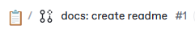

# 📖 Modern React Deep Dive

이 공간은 **모던 리액트 딥다이브** 책을 기반으로 한 스터디 기록 아카이브입니다.\
모든 정리 자료와 질의 응답 및 토론 내용은 이 레포와 GitBook Space에 문서화됩니다.

***

### 📅 Study Schedule

* 기간: 2025-09-17 \~ 2025-10-31
* 매주 수요일 오후 1시
* 목표: **Chapter 1 \~ 10 완독 및 토론**

<table data-full-width="false"><thead><tr><th data-type="number">주차</th><th>날짜</th><th>범위</th><th data-type="users" data-multiple>발표자</th><th data-type="number">관련 이슈</th></tr></thead><tbody><tr><td>1</td><td>9/17</td><td>Ch01, Ch02</td><td></td><td>null</td></tr><tr><td>2</td><td>9/24</td><td>Ch03, Ch04</td><td></td><td>null</td></tr><tr><td>3</td><td>10/1</td><td>Ch05</td><td></td><td>null</td></tr><tr><td>4</td><td>10/8</td><td>Ch06</td><td></td><td>null</td></tr><tr><td>5</td><td>10/15</td><td>Ch07, Ch08</td><td></td><td>null</td></tr><tr><td>6</td><td>10/22</td><td>Ch09</td><td></td><td>null</td></tr><tr><td>7</td><td>10/29</td><td>Ch10 + 전체 회고</td><td></td><td>null</td></tr></tbody></table>

***

### 👥 Members

* 송시은 [sgoldenbird](https://github.com/sgoldenbird)
* 손수진 [pappaya109](https://github.com/pappaya109)
* 조인성 [Insung-Jo](https://github.com/Insung-Jo)
* 전유진 [yuj2n](https://github.com/yuj2n)

***

### **🪄Study Workflow**

* 발표자는 매주 한 명씩 랜덤으로돌아가며 진행
* 발표자가아닌팀원들은정리한내용중발표자와중복되지 않는 내용만 발표
* 공부하다 모르는 질문은 GitHub Discussions에 미리 올려서 질의응답및토론
* <mark style="background-color:yellow;">**개인 브랜치에 ch1, ch2 ... 폴더를 생성**</mark>하고 그 안에 정리한내용을 작성합니다.&#x20;

***

### 🪧Rules

#### 🤝 그라운드 룰

* **우리는 함께 성장한다** → 경쟁보다 협업! 서로를 존중하고 배우자.
* **매주 정한 분량만큼 책임감을 가지고 공부한다** → 꾸준함이 실력이다. 못할 경우 미리 이야기해요.
* **질문은 자유롭고, 설명은 친절하게** → 모르는 건 창피한 게 아니에요. 질문과 답변은 모두의 자산입니다.
* **Gitbook도 연습이다** → 커밋 메시지, PR 제목, 등을 신경 써서 남기기!
* **지속 가능한 스터디를 위해 필요에 따라 유연하게 조정한다** → 피드백을 바탕으로 같이 가꿔나가요.

#### 🤝 브랜치 규칙

* react 브랜치 = default 브랜치&#x20;
* react 브랜치를 기준으로 **각자 개인 브랜치를 생성**합니다.&#x20;
*   머지 후에 개인 브랜치를 react 브랜치 기준으로 동기화 하고 싶다면 아래와 같이 합니다.&#x20;

    ```
    git checkout sgoldenbird
    git pull --rebase origin react
    ```

#### 🤝 CR / PR 규칙

* 매주 화요일까지 react 브랜치로  CR / PR을 제출합니다.
*   CR / PR 제목은 `커밋 타입: 내용` 으로 작성합니다.&#x20;

    <div align="left"><figure><figcaption></figcaption></figure></div>
* GitBook에서 GitHub으로 동기화될 때는 **자동으로 커밋 메시지를 붙입니다.**

#### 🤝 이슈 규칙

* 어려운 문제를 만났을 경우, Discussions탭의 [Q\&A](https://github.com/front-studium/solveit/discussions/categories/q-a)를 활용해 질문 및 해결 방법을 공유합니다.

#### 🤝 커밋 규칙

* 정해진 분량 만큼 정리한 내용을 커밋합니다.
* 아래의 커밋 메시지 작성 규칙을 따릅니다:

<table><thead><tr><th width="137">커밋 타입</th><th width="266">설명</th><th>예시 메시지</th></tr></thead><tbody><tr><td><code>ch#:</code></td><td>챕터별 정리 추가</td><td><code>ch5: 리액트와 상태 관리 라이브러리 정리</code></td></tr><tr><td><code>update:</code></td><td>기존 문서 보강/수정 <br>(내용 확장, 예제 추가 등)</td><td><code>update: ch2에 컴포넌트 예시 추가</code>      </td></tr><tr><td><code>docs:</code></td><td>리드미 업데이트 </td><td><code>docs: update README</code> </td></tr><tr><td><code>chore:</code></td><td>기타 변경 사항</td><td><code>chore: update package dependencies</code></td></tr><tr><td><code>gitbook-#:</code></td><td>GitBook에서 GitHub으로 동기화</td><td><code>gitbook-4: 수정한 내용 자동 요약</code> </td></tr></tbody></table>

